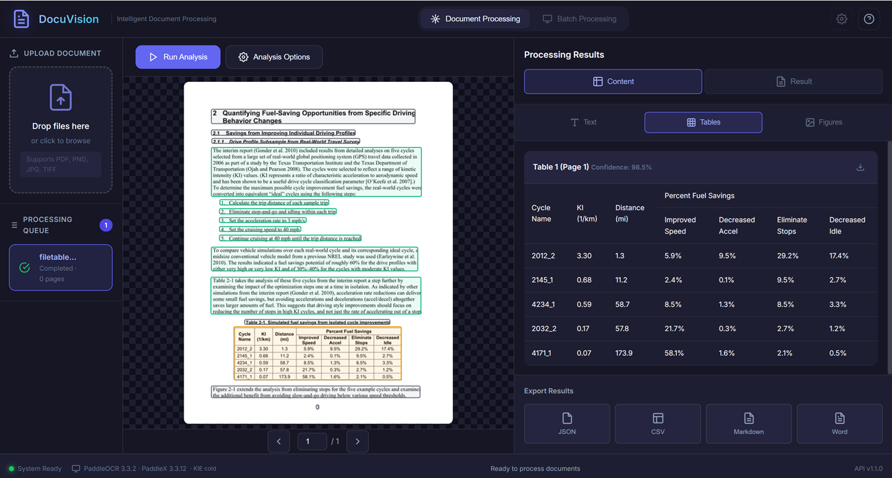
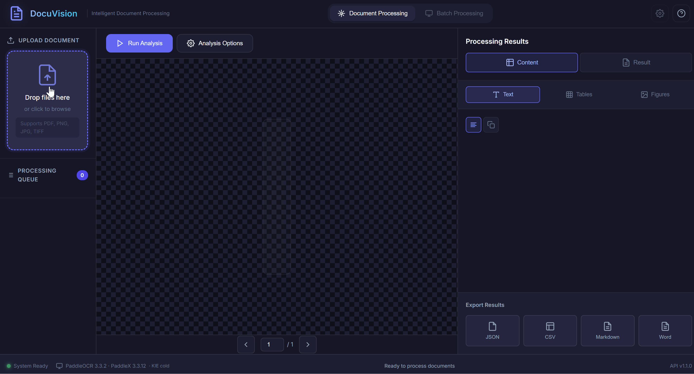
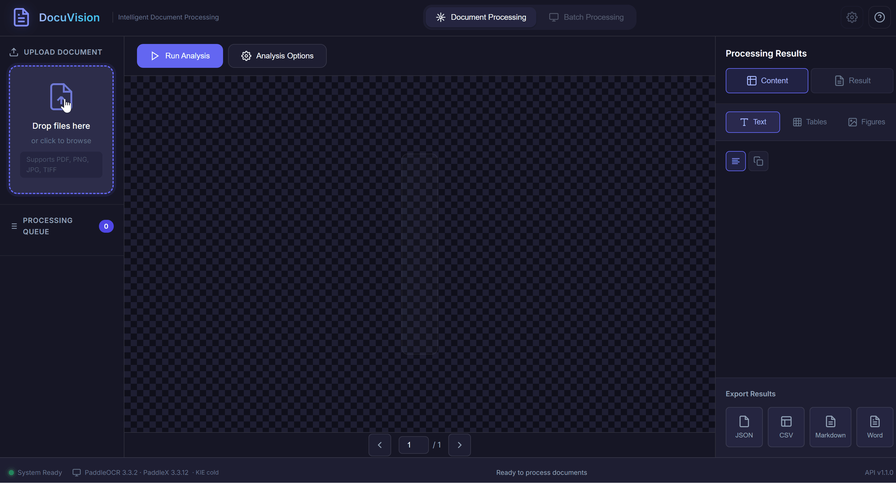
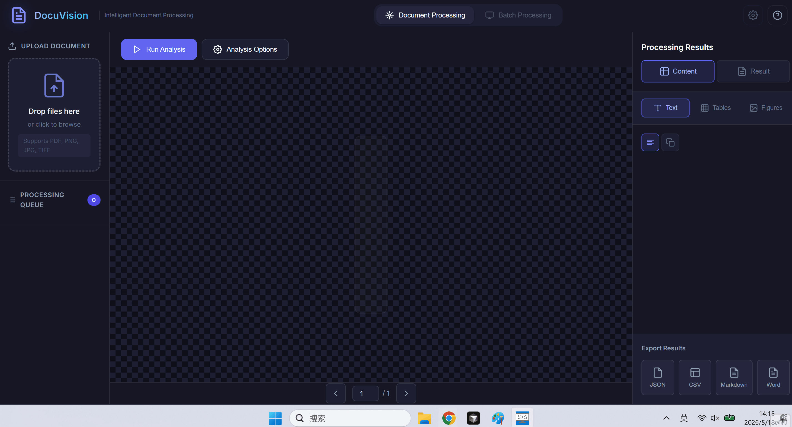
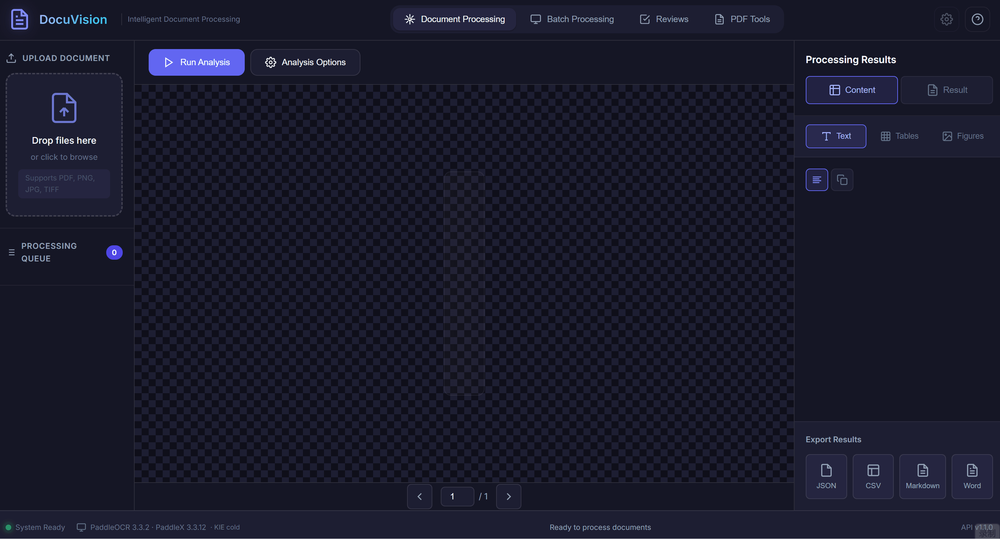
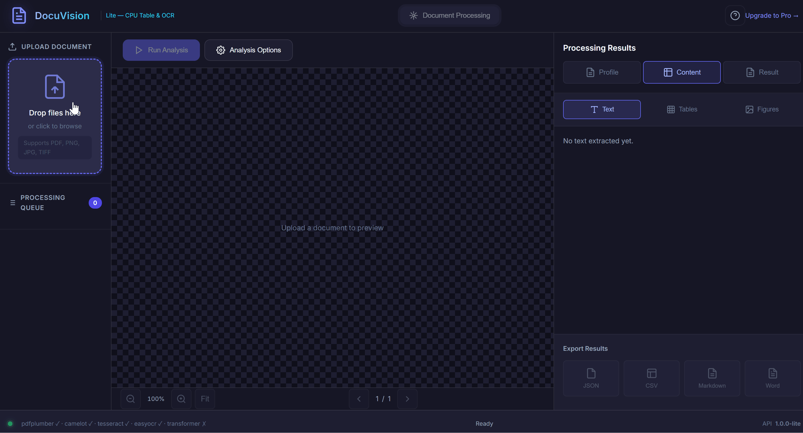

# DocuVision

DocuVision is an intelligent document processing stack built on [PaddleX](https://github.com/PaddlePaddle/PaddleX) and Qwen2.5-VL. It targets a **self-hosted**, **Azure Document Intelligence–style** workflow: layout and OCR, tables and figures, optional formulas and seals, and optional document-level **KIE** (key information extraction) when enabled.

---

## UI overview



The web UI is a static single-page app under `frontend/` (no Node build). Layout matches `frontend/index.html` and `frontend/README_FRONTEND.md`.

- **Top navigation**: **Document Processing** (default), **Batch Processing** (multi-file jobs + CSV/JSON/Excel export), **Reviews** (HITL KIE validation queue), **PDF Tools** (merge / split / metadata). **Settings** is disabled; **Help** opens API / help documentation (configurable URL, default `/docs`).
- **Analysis Options → Processing**: **Layout analysis** (default) or **Table mapping** (v1.4 — born-digital PDF only; templates `bank_statement`, `invoice_line_items`).
- **Left panel**: **Upload Document** (drag-and-drop or file picker for PDF, PNG, JPG, TIFF) and **Processing Queue** listing jobs in flight.
- **Center panel**: **document preview** with pagination, **Run Analysis**, and **Analysis Options** (modal) for pipeline toggles.
- **Right panel**: **Processing Results** with main tabs **Content** and **Result**. Content exposes sub-tabs (e.g. Text, Tables, **Mapped rows** when table mapping is used, Figures, and optional Fields / Formulas / Seals when the backend returns them). **Result** shows JSON with copy/download. **Export Results** offers structured export actions.
- **Footer (status bar)**: connection / readiness, **stack version** and **KIE ready/cold** driven by `GET /health`, plus **API version** from the same payload.

### Examples

Recording plan and pending filenames: [docs/architecture/media/README.md](docs/architecture/media/README.md).

**Layout analysis**



**Receipt KIE**



**Invoice KIE**



**Table mapping — bank statement** *(pending record: `M1_pro_map_bank_statement.gif`)*

<!--  -->

**Table mapping — invoice line items** *(pending record: `M2_pro_map_invoice_line_items.gif`)*

<!--  -->

**Batch → Excel MappedRows** *(pending record: `M3_pro_batch_mapped_excel.gif`)*

<!--  -->

**HITL Reviews** *(pending record: `M4_pro_hitl_review.gif`)*

<!--  -->

### Lite (CPU) — demo GIFs

CPU-friendly table extraction (born-digital PDF via Camelot / pdfplumber) and OCR (scanned PDF via Tesseract / EasyOCR).



## Repository layout

```
DocuVision/
├── backend/           # FastAPI Pro app (:8000), orchestrator, PaddleX, KIE
├── frontend/          # Pro static SPA
├── apps/lite/         # DocuVision Lite CPU app (:8001) + lite.html UI
├── packages/docuvision-core/  # Shared Lite table/OCR core library
├── docs/architecture/ # Design specs and trackers
└── test_data/         # acceptance, testfiles, Azure refs; TestResult excluded
```

---

## DocuVision Pro vs Lite

| | **Pro** | **Lite** |
|---|---------|----------|
| Port | `:8000` | `:8001` |
| Stack | PP-StructureV3 + optional Qwen KIE (+ **v1.1** runtime query fields) | pdfplumber / Camelot + EasyOCR / Tesseract |
| Best for | Layout, 5-type KIE + optional custom field names, GPU throughput | CPU, born-digital PDF tables, scan OCR |
| Run | `cd backend && python run.py` | `cd apps/lite/backend && python run_lite.py` |
| UI | `frontend/index.html` | `http://localhost:8001/lite/lite.html` |

Lite API: [docs/architecture/lite-api.md](docs/architecture/lite-api.md). Limitations: [Known limitations](docs/release/KNOWN_LIMITATIONS.md).

---

## Getting started (outline)

### Pro (GPU recommended)

1. **Environment**: GPU recommended for production-like latency.
2. **Python dependencies**: `cd backend && pip install -r requirements.txt` — follow the header comments for Paddle / torch vs. preinstalled images.
3. **Configuration**: use `backend/.env` (you may copy from `backend/.env.cloud` where provided). Do not commit secrets.
4. **Run the API** (from `backend/`):

   ```bash
   python run.py
   ```

   The frontend defaults to `http://localhost:8000/api/v1`; adjust `frontend/app.js` if needed.
5. **Open the UI**: open or serve `frontend/index.html` (on **Baidu AI Studio**, use `{project_base}/api_serving/8000/frontend/index.html` — see [CLOUD_VALIDATION.md](docs/architecture/CLOUD_VALIDATION.md) §1.1).
6. **Cloud / KIE regression** (optional): see [docs/architecture/CLOUD_VALIDATION.md](docs/architecture/CLOUD_VALIDATION.md) and [docs/architecture/kie.md](docs/architecture/kie.md).

### Lite (CPU)

1. Install Lite deps: see [apps/lite/backend/README.md](apps/lite/backend/README.md).
2. Bootstrap models once: [packages/docuvision-core/models/README.md](packages/docuvision-core/models/README.md).
3. Run: `cd apps/lite/backend && python run_lite.py`
4. Open: `http://localhost:8001/lite/lite.html`
5. Cloud validation: [CLOUD_VALIDATION.md](docs/architecture/CLOUD_VALIDATION.md) sections G0–H.

7. **Release notes**: [CHANGELOG.md](CHANGELOG.md) · [v1.4.0](docs/release/RELEASE_1.4_NOTES.md) · [Known limitations](docs/release/KNOWN_LIMITATIONS.md) · KIE regression: [CLOUD_VALIDATION.md](docs/architecture/CLOUD_VALIDATION.md)

---

## Documentation

- **Index**: [docs/README.md](docs/README.md)
- **System design**: [docuvision-system-design.md](docs/architecture/docuvision-system-design.md)
- **Cloud validation**: [CLOUD_VALIDATION.md](docs/architecture/CLOUD_VALIDATION.md)
- **Acceptance**: [test_data/acceptance/README.md](test_data/acceptance/README.md)
- **Release archive**: [docs/release/README.md](docs/release/README.md)

---


## License

This project is licensed under the [MIT License](LICENSE).
