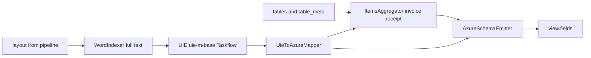

# 文档级 KIE（关键信息抽取）

> 本文档描述 **当前实现** 与 **对外契约**；系统总纲见 [智能文档处理系统设计方案.md](./智能文档处理系统设计方案.md) §7.8、§9。云端验收记录见 [KIE_TEST_RUN_TRACKER.md](./KIE_TEST_RUN_TRACKER.md)。

## 1. 目标与范围

- **目标**：对 `invoice` / `receipt` / `id_card` 等类型，在通用版面与表格流程之后，输出 **Azure 风格的结构化字段**，供 API 与前端 **Content > Fields** 展示。
- **不在本文**：通用 OCR、表格单元格解析、公式/印章（见总纲）。

## 2. 当前引擎与代码入口

| 项目 | 说明 |
|------|------|
| 推理引擎 | PaddleNLP `Taskflow('information_extraction', model='uie-m-base')` |
| Worker | 子进程常驻 UIE，避免主进程重复加载权重；见 `backend/app/services/kie_service.py` |
| 服务入口 | `DocumentKIEService.extract_fields(...)` |
| 编排 | `kie_step` 在 `document_pipeline_orchestrator.py` 中于表格等步骤之后执行；`finalize_step` 将 `kie_fields` 写入 `view.fields` |

**与总纲 §2 的关系**：总纲表格中的「证件/票据字段提取」行指向本文；**不是** PP-ChatOCRv4-doc，也 **不是** Taskflow `uie-x-base` 的「原图 + 布局」多模态路径。

## 3. 数据流（简图）

- **输入**：`layout`（PP-Structure 等来源的字典）、可选 `tables` / `table_extraction_meta`；`preprocessed_image_path` 用于日志与溯源，**不**作为 UIE 的像素输入。
- **核心文本**：`WordIndexer.from_layout(layout)` 得到 **整页 OCR 拼接字符串**；为空则 KIE 直接返回空字段并带 `reason: empty_ocr_text`。
- **输出**：`extract_fields` 返回 `fields`（`view.fields` 形状）、`confidence_avg`、`items_count`、`metadata`、`debug_input`。

## 4. Schema 与 `document_type` 路由

- UIE 的 schema 按类型定义于：
  - `backend/app/services/kie/schemas/invoice.py`
  - `backend/app/services/kie/schemas/receipt.py`
  - `backend/app/services/kie/schemas/id_card.py`
- 聚合模块：`backend/app/services/kie/items_aggregator.py`（发票/收据明细行）。
- 映射与类型：`uie_to_azure.py`、`azure_schema.py`、`azure_emitter.py`、`value_typer.py`。

支持的 `document_type`（KIE 分支）：`invoice`、`receipt`、`id_card`。其他类型在 `kie_step` 中记为 `skipped_doc_type`。

## 5. 对外契约（稳定）

以下字段应视为 **API/前端依赖的稳定契约**；更换底层引擎时优先保持兼容。

### 5.1 `view.fields`

- Azure 风格字典：键为逻辑字段名，值为带 `type` / `value*` / `content` / `confidence` 等结构的对象（见总纲 §8.3 示例形态；实际以 `BaseField` 序列化为准）。
- 编排器仅在 `kie_fields` 非空时写入 `view.fields`。

### 5.2 `quality.kie_*`

见总纲 §7.8 表格。实现位置：`document_pipeline_orchestrator.py` 中 `finalize_step` 对 `kie_meta` 的映射。

### 5.3 任务结果中的 `kie_meta` / `kie_fields` / `kie_input`

- `kie_meta`：`attempted`、`succeeded`、`stage`、`error_code`、`error_message`、成功时的 `confidence_avg`、`items_count`、`items_source`、`kie_model_load_ms`、`ocr_text_length`。
- `kie_input`：`file_path`、`preprocessed_image_path`、`layout_present`、`table_meta`、`tables_count`。
- 前端：`pickKieFieldsMap` 优先 `result.kie_fields`，否则 `result.view.fields`。

## 6. 已知局限（当前架构）

- **整页线性文本 + UIE**：表格多列、键值空间分离等场景，信息在拼接文本中可能弱化；**换 `uie-m-large` 或调 prompt/schema** 可改善一部分，但根因可能是「无显式布局进 UIE」。
- **长段落抽取**：UIE 类模型对超长段落 span 可能不完整（社区常见反馈）；必要时需分块策略或换引擎。
- **`kie_confidence_source`**：当前在 orchestrator 中硬编码为 `uie-m-base`（当 `kie_attempted` 时）；更换引擎时应改为配置或枚举。

## 7. 测试与本地验证

- 单测：`backend/tests/test_kie_service.py`、`backend/tests/test_kie_return_raw_contract.py`、`backend/tests/test_orchestrator_order.py`、`backend/tests/kie/` 下用例。
- 冒烟：`backend/tests/kie/_smoke_check.py`、`backend/tests/probe_kie_invoice.py`（需真实 PaddleNLP 环境）。
- 验收基线：`backend/tests/test_kie_acceptance_baseline.py`、`backend/tests/generate_kie_hit_miss_report.py`。

## 8. 路线图：可选第二引擎（如 Qwen2.5-VL）

以下为 **规划约束**，实施时单独 PR。

| 原则 | 说明 |
|------|------|
| 契约优先 | 新引擎仍应产出相同形状的 **`view.fields`** 与 **`quality.kie_*`**（或提供版本化迁移说明） |
| 服务边界 | 可实现为 `DocumentKIEService` 内部分支或并列 `*KIEService`，由配置 `KIE_ENGINE=uiem|vl|...` 选择 |
| 质量字段 | `kie_confidence_source` / 未来 `kie_engine` 应反映真实后端；VL 的置信度语义需文档化 |
| 输入差异 | VL 可直接吃 **原图/裁剪图**；若与现有 UIE 并行，注意 **合规与出网策略** |
| Taskflow `uie-x-base` | 若采用图片+布局路径，属于 Paddle 栈内另一实现，同样应收敛到上述契约 |

详细产品层对比（OCR+UIE vs 多模态 Taskflow vs VLM）见对话与外部资料，本文不重复展开。

## 9. 相关文件索引

| 路径 | 职责 |
|------|------|
| `backend/app/services/kie_service.py` | 子进程引擎 + `DocumentKIEService` |
| `backend/app/orchestration/document_pipeline_orchestrator.py` | `kie_step`、`finalize_step`、quality 映射 |
| `backend/app/main.py` | 注入 `kie_service`；`invoice`/`receipt`/`id_card` 可自动 `enable_kie` |
| `frontend/app.js` | `updateContentFields`、`pickKieFieldsMap`、`formatKieFieldForExtract` |
