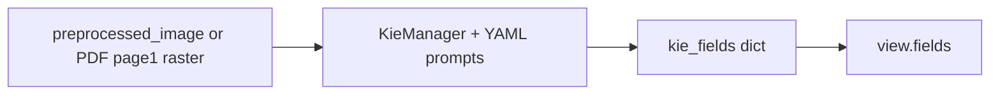

# 文档级 KIE（关键信息抽取）

> 本文档描述 **当前实现** 与 **对外契约**；系统总纲见 [智能文档处理系统设计方案.md](./智能文档处理系统设计方案.md) §7.8、§9。云端验收记录见 [KIE_TEST_RUN_TRACKER.md](./KIE_TEST_RUN_TRACKER.md)。

## 1. 目标与范围

- **目标**：对 `invoice` / `receipt` / `id_card` / `passport` / `bank_card` / `card_group` 等类型，在通用版面与表格流程之后，输出 **结构化字段（当前为 Qwen2.5-VL 按 YAML schema 解析得到的 JSON 字典）**，供 API 与前端 **Content > Fields** 与最终任务 JSON 展示。
- **不在本文**：字段级 bbox 与画布联动（可后续增量）；通用 OCR、表格单元格解析、公式/印章（见总纲）。
- **依赖与显存**：主流程 KIE 使用 **Hugging Face `transformers` + Qwen2.5-VL**，与 Paddle GPU 栈可共存于同一机，但 **峰值显存叠加**，部署时需预留或分时。

## 2. 当前引擎与代码入口

| 项目 | 说明 |
|------|------|
| 推理引擎 | **Qwen2.5-VL**（`Qwen2_5_VLForConditionalGeneration` + `AutoProcessor`） |
| Prompt / Schema | `backend/app/services/kie/kie_configs/*.yaml`，由 [`KieManager`](../../backend/app/services/kie/KieManager.py) 加载 |
| 服务入口 | **`QwenDocumentKIEService.extract_fields(...)`**（[`kie_qwen_service.py`](../../backend/app/services/kie_qwen_service.py)） |
| 编排 | `kie_step` 在 `document_pipeline_orchestrator.py` 中于表格等步骤之后执行；`phase1_envelope_step` 将非空 `kie_fields` 写入 `view.fields` |
| 历史实现 | PaddleNLP UIE（`kie_service.py` 内 `DocumentKIEService`）保留在仓库中供对照与离线脚本，**主应用 `main.py` 已改为注入 Qwen 服务** |

环境变量（可选）：`DOCUVISION_KIE_QWEN_MODEL_ID`、`DOCUVISION_KIE_QWEN_DEVICE_MAP`、`DOCUVISION_KIE_QWEN_TORCH_DTYPE`（见 `app/core/config.py`）。

## 3. 数据流（简图）



- **输入图像**：优先 `preprocessed_image_path`（与版面坐标对齐）；若无且上传为 **PDF**，服务内用 PyMuPDF 将 **第 1 页** 栅格化为临时 PNG 再推理，结束后删除临时文件。
- **文本类 layout/tables**：传入 `extract_fields` 仅用于 `debug_input` 溯源；**VL 推理不依赖** `WordIndexer` 全文。
- **输出**：`extract_fields` 返回 `fields`（纯 JSON 兼容 dict，可能含 `raw_output` 键表示模型未产出合法 JSON）、`confidence_avg`（当前恒为 0.0）、`items_count`、`metadata`（含 `engine: qwen2.5-vl`、`resolved_document_type`、`kie_model_load_ms` 等）、`debug_input`。

## 4. Schema 与 `document_type` 路由

- VL 的 schema 与 prompt 模板按类型定义于：`backend/app/services/kie/kie_configs/`（`_registry.yaml` 登记类型）。
- `card_group`：由 `KieManager` 内二次调用先做卡证三分类（`id_card` / `passport` / `bank_card`），再按识别类型抽取。

`kie_step` 支持的 `document_type`：`invoice`、`receipt`、`id_card`、`passport`、`bank_card`、`card_group`。`auto` 仍跳过 KIE（`skipped_doc_type`）。

## 5. 对外契约（稳定）

以下字段应视为 **API/前端依赖的稳定契约**；更换底层引擎时优先保持兼容。

### 5.1 `view.fields` / `kie_fields`

- 当前为 **扁平或嵌套的 JSON 友好 dict**（非强制 Azure `BaseField` 形态）；前端 `formatKieFieldForExtract` 对非 Azure 结构会回退为 `JSON.stringify` 展示。
- 编排器仅在 `kie_fields` 非空时写入 `view.fields`。

### 5.2 `quality.kie_*`

见总纲 §7.8 表格。实现位置：`document_pipeline_orchestrator.py` 中 `phase1_envelope_step` 对 `kie_meta` 的映射。

### 5.3 任务结果中的 `kie_meta` / `kie_fields` / `kie_input`

- `kie_meta`：`attempted`、`succeeded`、`stage`、`error_code`、`error_message`、成功时的 `confidence_avg`、`items_count`、`items_source`、`kie_model_load_ms`、`ocr_text_length`（Qwen 路径下 `ocr_text_length` 可能为 0）。
- `kie_input`：`file_path`、`preprocessed_image_path`、`layout_present`、`table_meta`、`tables_count`。
- 前端：`pickKieFieldsMap` 优先 `result.kie_fields`，否则 `result.view.fields`。

## 6. 已知局限（当前架构）

- **整页图像 + VL**：长文档多页仅消费首页栅格（与当前 PDF 策略一致）；多页票据需产品层扩展。
- **解析鲁棒性**：模型若输出非严格 JSON，字段区会退化为 `raw_output` 文本块。

## 7. 参考与测试

- 契约单测：`backend/tests/test_kie_return_raw_contract.py`、`backend/tests/test_kie_service.py`（mock `KieManager`，不下载权重）。
- Paddle UIE 聚合/映射链的离线校验仍见 `backend/tests/kie/_smoke_check.py`（针对 `kie_service.py` 与 mapper，不等价于线上主路径）。

### 7.1 云端 GPU-environment 针对性 pytest（本阶段）

在 **`backend/` 目录**、已激活与线上一致依赖的 venv 下执行（本地无完整依赖时不要求跑）：

```bash
cd backend
pytest tests/test_kie_service.py tests/test_kie_return_raw_contract.py tests/test_orchestrator_order.py -q
```

**期望**：上述文件内用例全部 **passed**。说明：`test_kie_service.py` 不加载真实 Qwen 权重；若 `import app` 链仍依赖 Paddle 等，须在已安装 backend 的云端环境执行。全量回归可在合并前增加 `pytest tests/ -q`（耗时与跳过条件视环境而定）。
