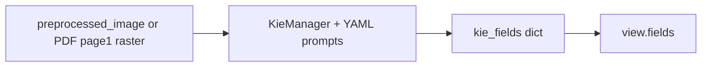

# 文档级 KIE（关键信息抽取）

> 本文档描述 **当前实现** 与 **对外契约**；系统总纲见 [智能文档处理系统设计方案.md](./智能文档处理系统设计方案.md) §7.8、§9。云端验收记录见 [KIE_TEST_RUN_TRACKER.md](./KIE_TEST_RUN_TRACKER.md)。**GPU 环境验证顺序**见 [CLOUD_VALIDATION.md](./CLOUD_VALIDATION.md)。

## 1. 目标与范围

- **目标**：对 `invoice` / `receipt` / `id_card` / `passport` / `bank_card` 等类型，在通用版面与表格流程之后，输出 **结构化字段（当前为 Qwen2.5-VL 按 YAML schema 解析得到的 JSON 字典）**，供 API 与前端 **Content > Fields** 与最终任务 JSON 展示。
- **不在本文**：字段级 bbox 与画布联动（可后续增量）；通用 OCR、表格单元格解析、公式/印章（见总纲）。
- **依赖与显存**：主流程 KIE 使用 **Hugging Face `transformers` + Qwen2.5-VL**，与 Paddle GPU 栈可共存于同一机，但 **峰值显存叠加**，部署时需预留或分时。

## 2. 当前引擎与代码入口

| 项目 | 说明 |
|------|------|
| 推理引擎 | **Qwen2.5-VL**（`Qwen2_5_VLForConditionalGeneration` + `AutoProcessor`） |
| Prompt / Schema | `backend/app/services/kie/kie_configs/*.yaml`，由 [`KieManager`](../../backend/app/services/kie/KieManager.py) 加载 |
| 服务入口 | **`QwenDocumentKIEService.extract_fields(...)`**（[`kie_qwen_service.py`](../../backend/app/services/kie_qwen_service.py)） |
| 编排 | `kie_step` 在 `document_pipeline_orchestrator.py` 中于表格等步骤之后执行；`phase1_envelope_step` 将非空 `kie_fields` 写入 `view.fields` |

环境变量（可选）：`DOCUVISION_KIE_QWEN_MODEL_ID`（默认指向 ModelScope 本地缓存：`/root/.cache/modelscope/hub/models/Qwen/Qwen2___5-VL-3B-Instruct`）、`DOCUVISION_KIE_QWEN_DEVICE_MAP`、`DOCUVISION_KIE_QWEN_TORCH_DTYPE`（见 `app/core/config.py`）。**`DOCUVISION_KIE_WARMUP`**：设为 `1`/`true`/`yes`/`on` 时，进程启动后在后台预加载 KIE 模型（不阻塞服务就绪；失败仅打日志）。**`backend/.env.cloud` 中默认写入 `DOCUVISION_KIE_WARMUP=1`**，便于云端首次分析前完成冷加载；显存紧张的本机复制为 `.env` 时可注释该行。首次真实推理仍可能较慢，取决于缓存与 GPU。

## 2.1 进度与可观测性

- WebSocket / 任务进度：进入 KIE 后依次推送 **`KIE: preparing model and inputs...`** 与 **`KIE: inference running...`**，完成仍为进度 80 的完成文案。
- 服务端日志：`kie_step` 打 **`KIE step start`** / **`KIE step completed`**（含 `task_id`、`document_type`、`fields_count`、`kie_infer_ms`、`kie_wall_ms` 等）；跳过与失败路径带 `stage` / `error_code`。

## 2.2 Python 依赖（torch / transformers）

- **清单**：见仓库根下 [`backend/requirements.txt`](../../backend/requirements.txt) 中 **KIE** 小节：`transformers` 与 **`torch` + `torchvision`**（均在 [`requirements-gpu-torch.txt`](../../backend/requirements-gpu-torch.txt)；GPU 环境用 PyTorch **cu124** 索引，勿只装 `torch`）。
- **与 Paddle 同机**：两者可能同时占 GPU 显存，请预留或分时；KIE 首次加载模型可达数十秒，可用 `DOCUVISION_KIE_WARMUP` 在空闲时预热。

## 3. 数据流（简图）



- **输入图像**：
  - 优先 **栅格图** 形式的 `preprocessed_image_path`（layout 预处理输出，扩展名 `.png`/`.jpg` 等）。
  - 编排器 **不会** 再用原始 `file_path` 回填 `preprocessed_image_path`（避免 PDF 被 PIL 直接打开）。
  - 若无有效栅格预处理图且上传为 **PDF**，`kie_qwen_service._resolve_kie_image_path` 用 PyMuPDF 将 **第 1 页** 栅格化为临时 PNG，推理结束后删除。
- **文本类 layout/tables**：传入 `extract_fields` 仅用于 `debug_input` 溯源；**VL 推理不依赖**版面全文拼接。
- **输出**：`extract_fields` 返回 `fields`（纯 JSON 兼容 dict，可能含 `raw_output` 键表示模型未产出合法 JSON）、`confidence_avg`（关键字段填充率启发值）、`items_count`、`metadata`（含 `engine: qwen2.5-vl` 等）、`debug_input`。

## 4. Schema 与 `document_type` 路由

- VL 的 schema 与 prompt 模板按类型定义于：`backend/app/services/kie/kie_configs/`（`_registry.yaml` 登记类型）。

`kie_step` 支持的 `document_type`：`invoice`、`receipt`、`id_card`、`passport`、`bank_card`、`financial_report`。`auto` 仍跳过 KIE（`skipped_doc_type`）。

### 4.1 自定义字段（v1.1 Query Fields）

- 请求参数：`kie_query_fields`（JSON 数组，最多 20 项，**仅追加**内置 YAML 顶层键）。
- 实现：[`query_fields.py`](../../backend/app/services/kie/query_fields.py)、设计说明 [kie-custom-fields.md](./kie-custom-fields.md)。
- **KIE-ACCEPT-002 不检查** query 字段是否填充；观察性指标见 `quality.kie_query_fields_requested` / `kie_query_fields_filled`。

## 5. 对外契约（稳定）

以下字段应视为 **API/前端依赖的稳定契约**；更换底层引擎时优先保持兼容。

### 5.1 `view.fields` / `kie_fields`

- 当前为 **扁平或嵌套的 JSON 友好 dict**（非强制 Azure `BaseField` 形态）；前端 `formatKieFieldForExtract` 对非 Azure 结构会回退为 `JSON.stringify` 展示。
- 编排器仅在 `kie_fields` 非空时写入 `view.fields`。

### 5.2 `quality.kie_*`

见总纲 §7.8 表格。实现位置：`document_pipeline_orchestrator.py` 中 `phase1_envelope_step` 对 `kie_meta` 的映射。

增量（v1.10）：

- `kie_fields_count`：有意义字段数（排除仅 `raw_output`、空值不计），见 `kie_field_metrics.count_meaningful_kie_fields`。
- `kie_production_hit` / `kie_production_reason` / `kie_production_keys`：**KIE-ACCEPT-002** 生产验收，见 [KIE_ACCEPTANCE_CRITERIA.md](../../backend/tests/KIE_ACCEPTANCE_CRITERIA.md)。
- `kie_confidence_avg`：关键字段填充率启发值（`compute_fill_confidence`），非模型原生置信度。
- `kie_error_message`：失败路径摘要（与 `kie_meta.error_message` 一致）。

增量（v1.11）：

- `kie_query_fields_requested` / `kie_query_fields_filled`：运行时追加字段名与命中名（v1.1）。

### 5.3 任务结果中的 `kie_meta` / `kie_fields` / `kie_input`

- `kie_meta`：`attempted`、`succeeded`、`stage`、`error_code`、`error_message`、成功时的 `confidence_avg`、`items_count`、`items_source`、`kie_model_load_ms`、**`kie_infer_ms`**（服务内纯推理毫秒）、**`kie_wall_ms`**（编排器包裹 `extract_fields` 的墙钟毫秒）、`ocr_text_length`（Qwen 路径下 `ocr_text_length` 可能为 0）。
- `kie_input`：`file_path`、`preprocessed_image_path`、`layout_present`、`table_meta`、`tables_count`。
- 前端：`pickKieFieldsMap` 优先 `result.kie_fields`，否则 `result.view.fields`。

## 6. 已知局限（当前架构）

- **整页图像 + VL**：长文档多页仅消费首页栅格（与当前 PDF 策略一致）；多页票据需产品层扩展。
- **解析鲁棒性**：模型若输出非严格 JSON，字段区会退化为 `raw_output` 文本块。
- **字段精度**：基线样本已通过 Cloud 验收；身份证等场景可能仅命中部分关键键（如 `name` 无 `id_number`），需按样例继续调 prompt/schema。

## 7. 参考与测试

- 契约单测：`backend/tests/test_kie_return_raw_contract.py`、`backend/tests/test_kie_service.py`（mock `KieManager`，不下载权重）。
- 轻量脚本：`python -m tests.kie._smoke_check`（仅 `value_typer`，无模型）。

### 7.1 云端 GPU-environment 针对性 pytest（本阶段）

在 **`backend/` 目录**、已激活与线上一致依赖的 venv 下执行（本地无完整依赖时不要求跑）：

```bash
cd backend
pytest tests/test_kie_field_metrics.py tests/test_kie_service.py tests/test_kie_return_raw_contract.py tests/test_orchestrator_order.py -q
```

**期望**：上述文件内用例全部 **passed**。说明：`test_kie_service.py` 不加载真实 Qwen 权重；若 `import app` 链仍依赖 Paddle 等，须在已安装 backend 的云端环境执行。

**全量 `pytest tests/`**：须满足 `requirements.txt` 中的 **`httpx<0.28`**（与 FastAPI 0.109 的 `TestClient` 兼容）。若 venv 里误装了 `httpx>=0.28`，会出现 `Client.__init__() got an unexpected keyword argument 'app'`，请先执行 `pip install "httpx>=0.24,<0.28"` 再跑全量。

**在修好 httpx 前临时跳过** 仅依赖 `TestClient` 的用例（不推荐长期如此）：

```bash
pytest tests/ -q --ignore=tests/test_analyze_kie_options.py
```

**按主题分批（期望均为 passed）**：

```bash
# KIE 与编排契约
pytest tests/test_kie_service.py tests/test_kie_return_raw_contract.py tests/test_orchestrator_order.py tests/test_kie_acceptance_baseline.py -q

# Envelope / 表格策略等（不 import app.main 全量 Paddle 的优先单独列——若某文件 import main 仍会慢）
pytest tests/test_envelope_builder.py tests/test_table_strategy_meta.py -q

# kie 子包纯单测（value_typer 等，不跑 main）
pytest tests/kie/test_value_typer.py -q
```

全量回归：`pytest tests/ -q --tb=short`（耗时与 Paddle 模型缓存命中情况视环境而定）。
